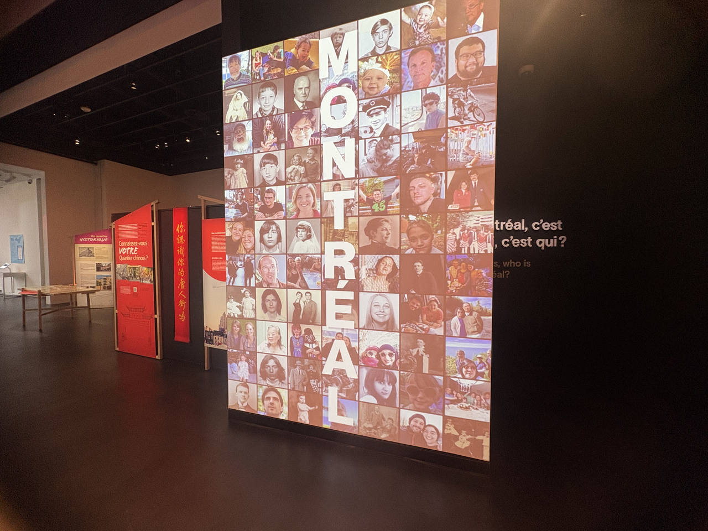

# Centre des mémoires montréalaises - Machine à voyager dans le temps

## Introduction

Mise en exposition à l'exposition au Centre des mémoires montréalaises : 1210 Boul. Saint-Laurent, Montréal, QC H2X 2S5

(1)

## Informations sur le dispositif :

- « Une machine à voyager dans le temps » ("A time machine" en anglais)
   
   
 
(1)
 
- Conçu par la firme Directedbyvea
    
   
- Mis sur pied en 2024
   
 
- Dans le cadre de l'exposition permanente « Montréal »
    
    

(1)
    
  
- Visite effectuée le 20 février 2026

  

