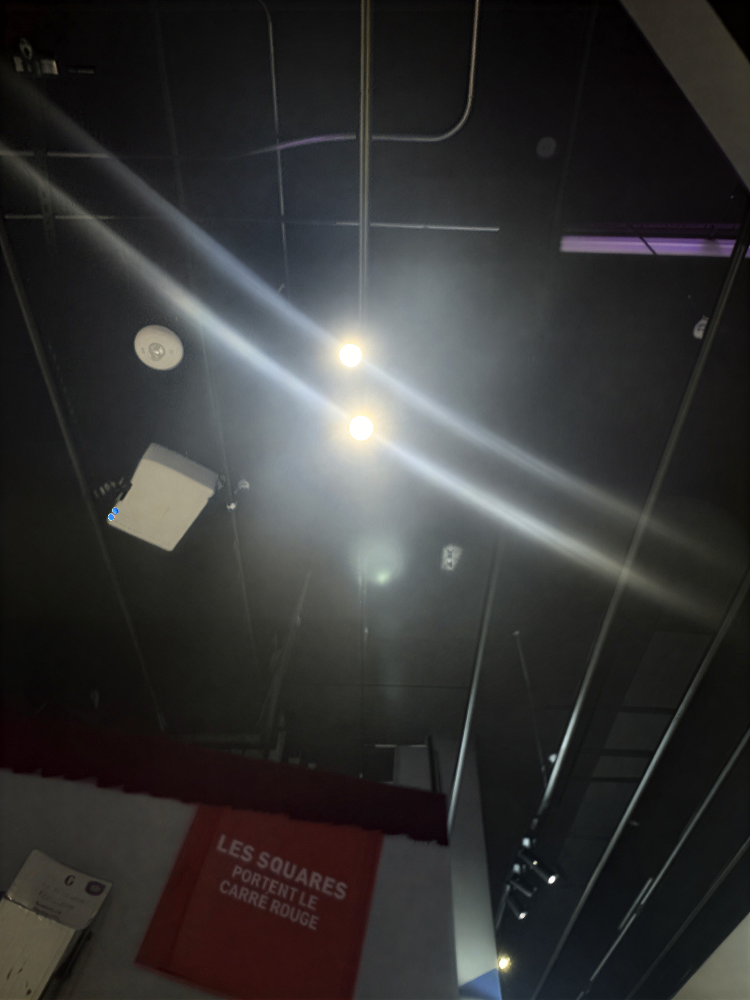
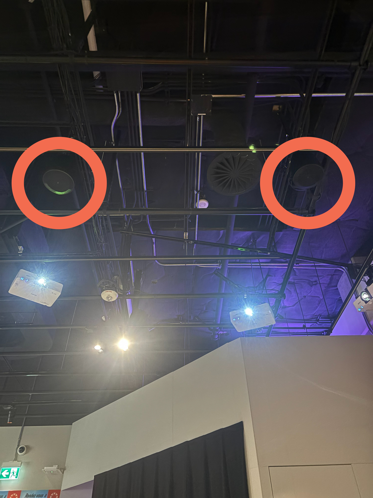
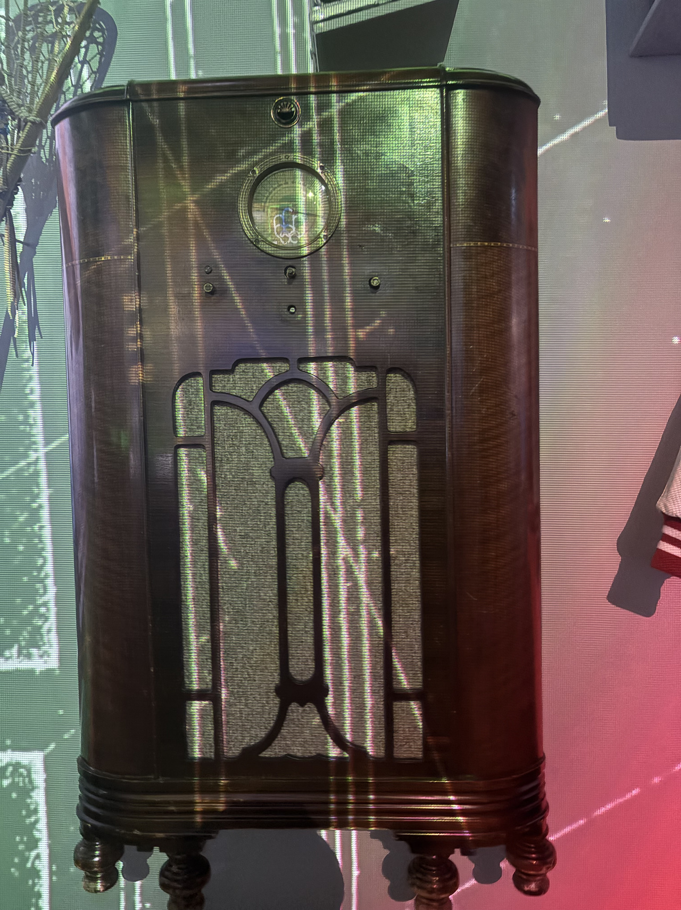
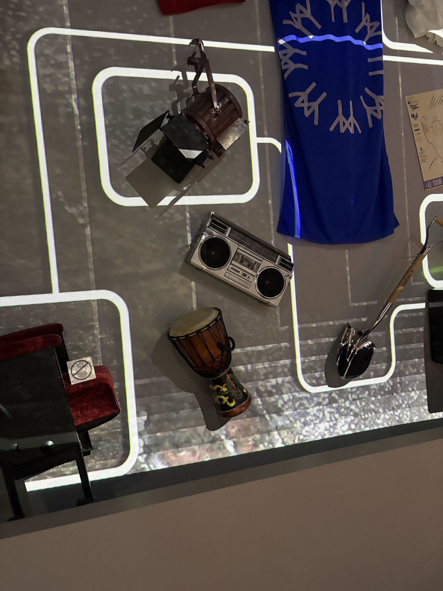
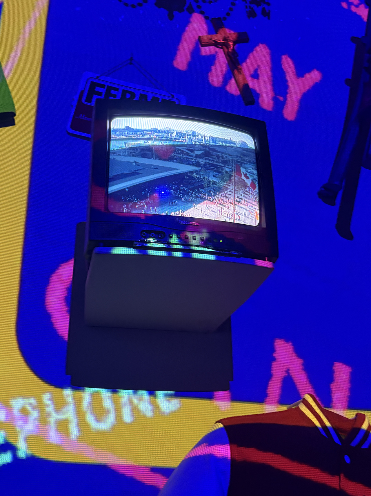
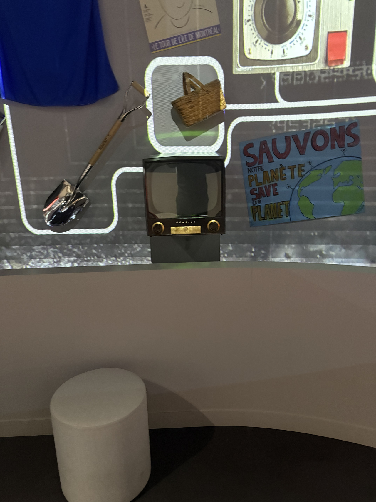
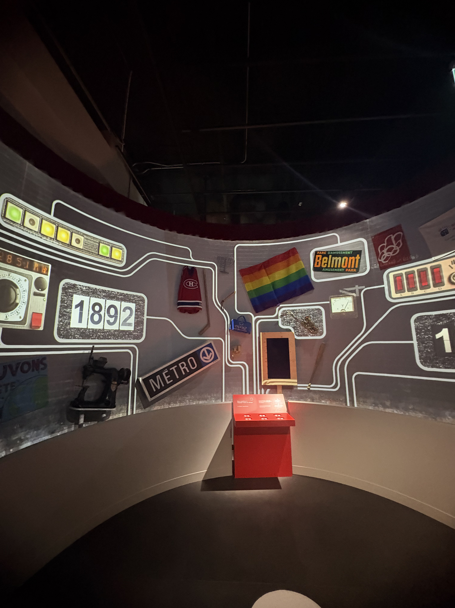
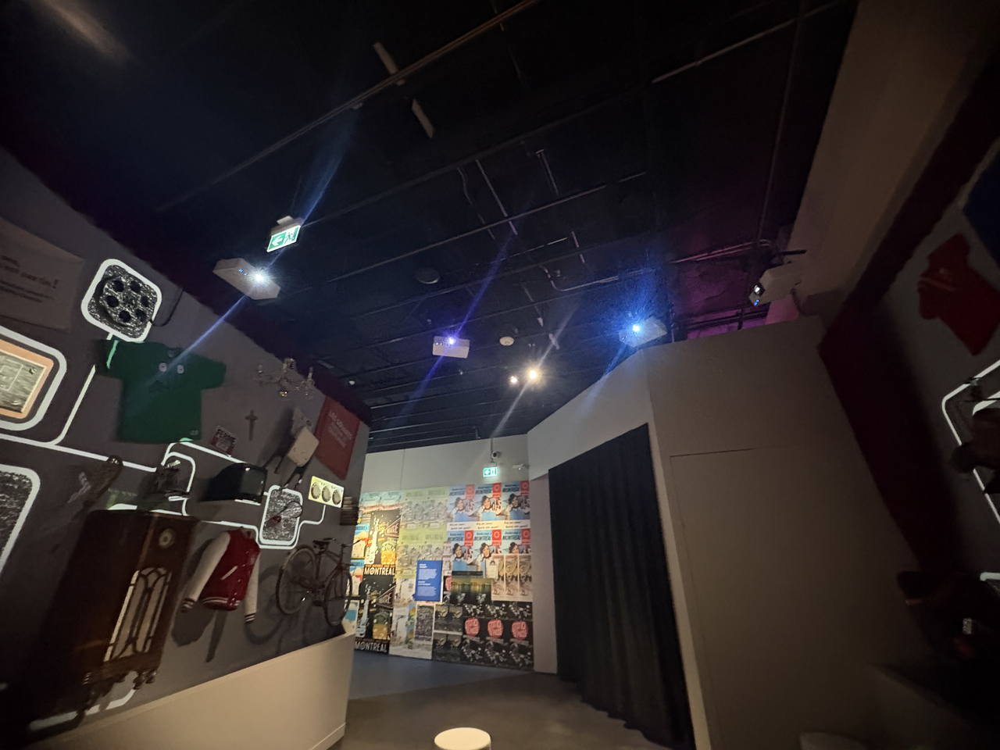
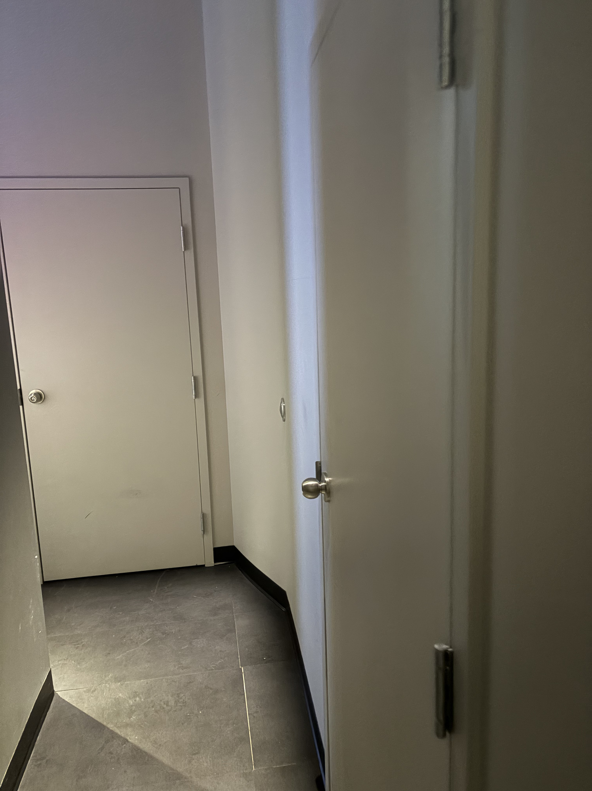
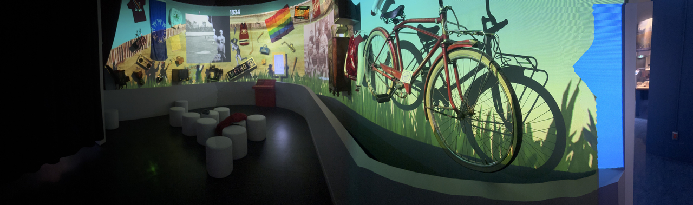

# Centre des mémoires montréalaises - Machine à voyager dans le temps

## Introduction

Mise en exposition à l'exposition au Centre des mémoires montréalaises : 1210 Boul. Saint-Laurent, Montréal, QC H2X 2S5

(1)

## Informations sur le dispositif 

- « Une machine à voyager dans le temps » ("A time machine" en anglais)
  
 
(1)

- Conçu par la firme Directedbyvea 
- Mis sur pied en 2024
- Dans le cadre de l'exposition permanente « Montréal »
   

(1)

- Visite effectuée le 20 février 2026

## Description du dispositif 

- Installation interactive
- Le dispositif vise la transmission du patrimoine immatériel, dans le cas présent, la richesse historique de notre pays

### Composantes et techniques

- Projecteurs lumineux : Éclairent la pièce

 
 (1)

- Panneau d’affichage : Diffuse du contenu en lien avec certains éléments présentés sur le mur incurvé durant les vidéos

 
 (1)

- Haut-parleurs : Diffusent les sons provenant de l'ordinateur.

(1)

Il arrive, parfois, que des doubleurs incarnent des personnages ayant vécu à l’époque où les faits étant relatés ont pris place ou lisent des citations écrites. Dans ce cas, le son sort de deux autres haut parleurs situés à l’intérieur de la radio rétro et de la radiocassette visibles ci-dessous. Ces derniers émettent une source sonore indépendante des deux haut parleurs principaux. Les fréquences sonores sont filtrées pour donner une touche différente au son. 

(1)

(1)

- Téléviseurs rétros Curtis et Admiral : Lorsque certaines images d’archives sont diffusées à l’écran, un téléviseur ou l'autre s’allume et duplique ce contenu.

 
(1)
 
(1)

- Mur incurvé : Rend possible la projection des fichiers vidéos utilisés pour l’exposition avec la configuration de projecteurs.

 
 (1)

- Projecteurs Epson : Permettent la diffusion des vidéos utilisées par le dispositif. Quatre disposés dans des angles différents pour couvrir l’intégralité du mur.

(1)

- Ordinateurs : Héberge les fichiers utilisés par le dispositif. Situé dans une pièce verrouillée à clé située derrière le mur incurvé (3)

(1)

### Mise en espace 

Le visiteur monte d’abord les escaliers vers le premier étage de l’immeuble. Après avoir fait vérifier son billet par un membre du personnel, il/elle/iel se voit offrir le choix de deux expositions différentes : Sur la gauche, l’exposition temporaire immersive « Détours - Rencontres urbaines ». Sur la droite, maintenant, se trouve toute la section consacrée à l’exposition que j’ai choisie. Le visiteur traverse un large couloir bourré de cartels et d’affiches informatives. Il est alors possible d’accéder au dispositif via une série de pièces dont l'entrée se situe juste à côté de l’affiche de l’exposition.

![Croquis de mise en espace du dispositif présenté par rapport au Centre des mémoires montréalaises. En regardant le comptoir à l'accueil, l'oeuvre est accessible vers la droite de l'établissement où se trouve l'exposition permanente « Montréal ». Le visiteur marche dans un premier couloir et, arrivé à mi-chemin de celu-ci, tombe sur l'affiche de l'exposition, qui se trouve à son entrée. Après avoir traversé plusieurs pièces en ligne plus ou moins droite, il est possible d'aller en sens inverse via un autre chemin qui, après avoir tourné à gauche deux fois consécutives, permet d'aboutir dans la zone du dispositif multimédia.](./images/centre_memoires_mtl_croquis_mise_espace.png)
(2)

### Terminologie 

- L'oeuvre diffuse un écran d'accueil accompagnant de sons d'horloges rapides s'accumulant les uns au-dessus des autres
- Mur couvert d'objets associés à notre culture passée et présente

## Description de l'expérience vécue

Le visiteur arrive devant une salle munie de multiples projecteurs diffusant une vidéo en boucle sur un mur incurvé. Elle sert, en quelque sorte, de « menu d’accueil »au dispositif multimédia. Le mur est bourré d’objets historiques ou pouvant être associés à la culture montréalaise, tels que d’anciens chandails du Canadien de Montréal, un saxophone, des télévisions rétros et tant d’autres. Le cartel, interactif, donne, au visiteur, le choix entre six différentes capsules vidéos racontant l’histoire de notre métropole sous différentes facettes. On y explore, notamment, les innovations technologiques et culturelles ayant faites surface à Montréal, ses divers épisodes de tensions sociopolitiques, ses minorités historiques et tant d’autres éléments. Certains des sons perçus pendant la diffusion des vidéos proviennent même des objets eux-mêmes, en fonction de l’époque à laquelle ils sont associés (ex: Le son de citations lues à l’oral et datées du 19e siècle provient de cette radio rétro). Les vieilles télévisions diffusent le même contenu que les projecteurs lorsque certaines images d'archives sont diffusées.

(1)

## Appréciation critique

Points positifs :

- Certains des éléments du décor ont une utilité autre que esthétique, c’est-à-dire qu’ils émettent carrément du contenu sonore en lien avec les vidéos regardées, ce que je considère comme très créatif et adapté à la fonction du dispositif. Autrement dit, il n’y a pas des objets dans le simple et unique but qu’il y ait des objets.
- Interface d’accueil du dispositif. Les lignes projetées sur le mur ont un valeur presque poétique, comme si elles essayaient de démontrer que tous les événements de l’histoire sont liés à l’un et l’autre.

Points négatifs :

- Masquer la ventilation et les fils électriques avec un plafond afin d’embellir les lieux
- Enlever le fondu audio sortant et l’animation de fin sur la vidéo d’accueil de la machine à voyager dans le temps afin de briser l’impression, chez le spectateur, qu’il ne s’agit que d’une vidéo qui joue en boucle. La rendre plus longue, tout comme les vidéos jouant en boucle dans les salles d'exposition de Oasis Immersion.
- Les objets situés à l'avant obstruent légèrement l'écran.

## Références :

1 : Marc-Olivier Nadeau, 20 février 2026  
2 : Marc-Olivier Nadeau, 4 mars 2026  
3 : Employée du Centre des mémoires montréalaises - Élizabeth Courteau

  

