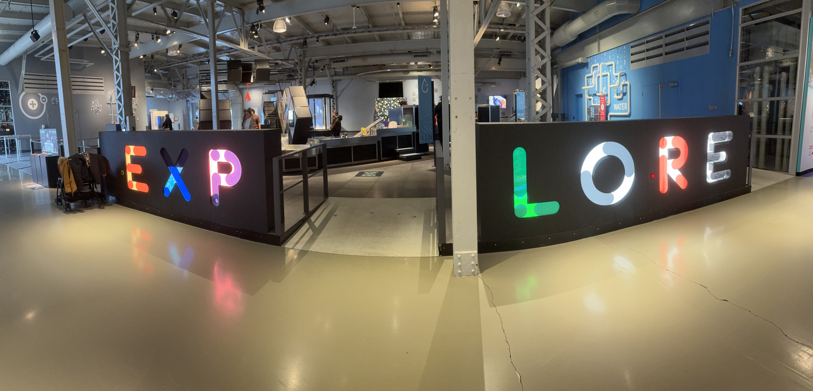
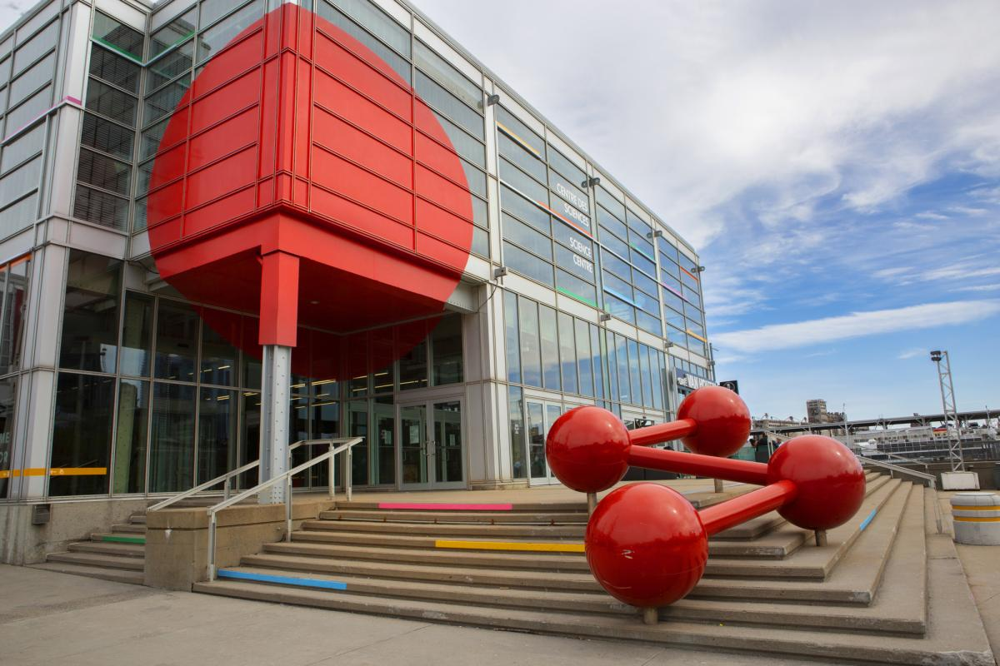

# Fiche d'exposition Centre des Sciences de Montréal

## Nom de l’exposition ou de l’événement : 

Explore 

## Lieu de mise en exposition :

2 R. de la Commune O, Montréal, QC H2Y 4B2 - Centre des sciences de Montréal

## Type d’exposition :

Permanente 

## Date de ma visite : 

Mercredi 1er avril 2026

## Titre de l’œuvre ou du dispositif :

Titre français : La vidéo sous tous les angles  
 
Titre anglais : Video that plays all the angles 

## Nom de l’artiste ou de la firme :

GSM Project

## Année de réalisation : 

2026

## Description de l’œuvre ou du dispositif : 

Le visiteur arrive devant un écran tactile où il/elle/iel contrôle une pseudo-application de montage vidéo. Celui-ci peut glisser des fichiers vidéos sur une interface et réorganiser leur ordre. Il peut également choisir entre plusieurs répertoires de médias différents, divers effets applicables à chacun des médias, tels que le tourbillon ou l'effet miroir fragmenté. Une fois son montage terminé, un bouton lui permet de lancer la projection de la vidéo réalisée sur le mur situé juste devant lui. Cette projection utilise le mapping, une technique qui adapte des projections à la surface de leur récepteur, qu'il s'agisse d'un mur ou d'un bâtiment.

## Type d’installation :

Interactive 

## Fonction du dispositif multimédia :

Support pédagogique

## Mise en espace : 

Le visiteur ou la visitrice rentre dans le bâtiment du Centre des sciences de Montréal et gravit les marches qui le mène au deuxième étage. Après avoir fait vérifier son billet par un membre du personnel, il se met à circuler dans un long couloir comportant plusieurs virages, plusieurs structures et cartes intégrées aux murs. Il/elle/iel tourne d'abord à gauche, puis ensuite en droite et aboutit dans la zone d'exposition. 

## Composantes et techniques : 

Ordinateur : Permet l'utilisation de l'application développée dans le cadre du dispositif multimédia.  
 
Écran tactile : Rend l'application fonctionnelle, contrôlable.  
 
Projecteur : Diffuse le contenu visuel généré par la carte graphique ou le processeur de l'ordinateur.  
 
Cartographie par projection : Technologie principale qu'utilise le dispositif multimédia. La cartographie par projection, ou, en anglais, le projection mapping, est une technique permettant de correctement projeter un contenu multimédia visuel quelconque (photo ou vidéo) sur une surface irrégulière. Le projecteur est lié à un ordinateur exécutant un des nombreux logiciels de cartographie par projection, tels que Resolume Arena, HeavyM, TouchDesigner ou MadMapper, ce dernier ayant été utilisé pour concevoir le dispositif multimédia. De façon générale, un aperçu visuel y est montré du point de vue du projecteur et il suffit de tracer des vecteurs autour de l'objet visé pour faire une projection épousant sa surface. Il y a cependant une contrainte technique dont il faut tenir compte : La couleur de l'objet doit être suffisamment claire afin qu'il puisse refléter la lumière produite. Il serait, par exemple très complexe d'exécuter la même technique sur une surface noire. (2)  

## Éléments nécessaires à la mise en exposition : 

Mur : Surface sur laquelle le contenu visuel de l'application est diffusée. On peut remarquer la présence de deux vitres sans tain, situées sur sa partie inférieure. Cela s'explique par le fait qu'il y ait une pièce avec un autre dispositif interactif, fenêtrée, derrière la forme irrégulière. À l'aide d'un verre spécial, il est alors possible pour tout contenu multimédia d'être diffusé normalement sur le mur alors même que les personnes à l'intérieur de la pièce arrière peuvent regarder en dehors de celle-ci.

## Expérience vécue : 

Je suis resté accroché à ce dispositif multimédia lorsque je me suis rendu compte de quoi il s'agissait. Tel que décrit dans mon portrait réalisé en début de session, le montage vidéo est mon intérêt multimédia principal. Hors caméra, l'oeuvre m'a bien fait rire alors que j'essayais de créer une composition avec des effets aussi bizarres et impertinents que possible. J'ai cependant été déçu de me rendre compte que la section de gauche ne fonctionnait pas. Ensuite, après avoir regardé le cartel et curieux d'en apprendre davantage sur la cartographie par projection, j'ai posé tellement de questions qu'ils ont décidé de faire venir un technicien en multimédia présent sur les lieux pour m'expliquer en quoi cette technologie consiste. Un aspect de l'oeuvre que j'ai particulièrement apprécie est le fait que, quand on y pense, le titre du dispositif prend un double sens : On joue la vidéo sous tous ses angles parce qu'on la projette fidèlement sur une surface malgré son irrégularité, mais on le fait aussi dans le sens où on manipule une vidéo à notre guise. On voit également donc la vidéo sous tous ses angles dans ce sens.

## Ce qui m’a plu :

- Design graphique de l'application
- Vidéos mises à disposition dans les différents répertoires de fichiers

## Ce que je ferais autrement : 

- Rendre plus clair la fonction des différents boutons sur l'écran tactile pour des personnes qui ne sont pas nécessairement familières avec le montage vidéo (il s'agit d'un dispositif visant, décidément, par son interface colorée et ses logos simples, des enfants).  
- Tester le dispositif avant de le rendre disponible pour m'assurer qu'il fonctionne parfaitement.

## Références :

1 - Marc-Olivier Nadeau, 1er avril 2026  
2 - Éric Donais, technicien en multimédia travaillant au Centre des sciences de Montréal, 1er avril 2026  
3 - Tinkernut, 24 mai 2014, https://www.youtube.com/watch?v=skU3T8bgEIM  
4 - Site web du Centre des sciences de Montréal, mai 2025
