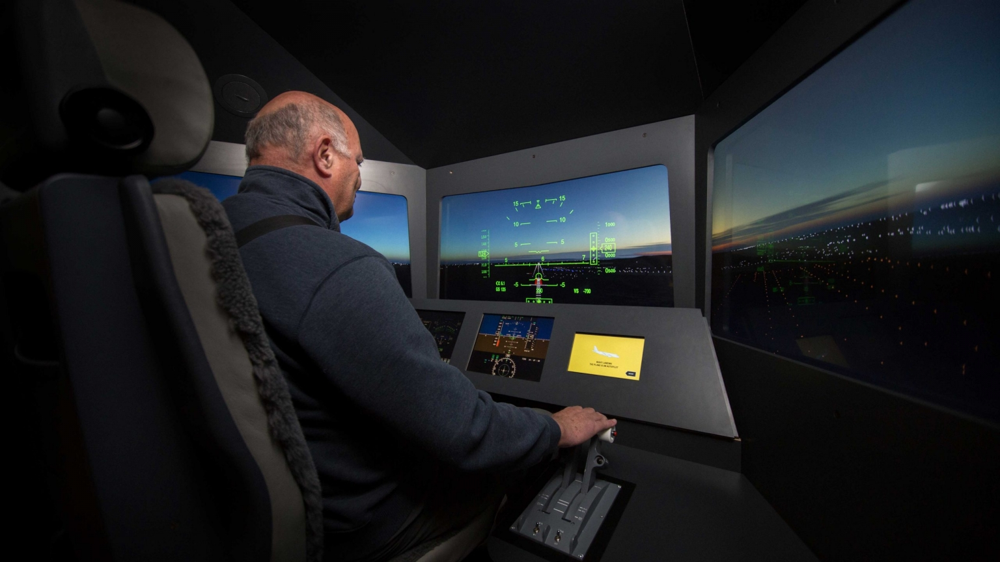

# Compte rendu de la conférence de Martin Boucher

## Introduction

Lors du cours d'œuvres et dispositifs multimédias en exposition du 24 avril 2026, nous avons reçu la visite via visioconférence de Martin Boucher, un technicien en multimédia venu nous présenter le processus de conception d'œuvres exposées au Musée de l'ingéniosité J.Armand-Bombardier. 

## Développement

Joseph-Armand Bombardier ayant d'abord inventé des véhicules à chenille, les œuvres sont généralement thématisées autour du transport. On peut voir en haut du paragraphe, par exemple, un simulateur d'avion conçu dans le cadre de l'exposition « Histoire de passions ». Les techniques utilisés par le musée pour ajouter une valeur artistique à leurs projets sont multiples : Une ancienne exposition présentait une salle comme le garage de Joseph Armand-Bombardier. Voix et lumières étaient coordonnées alors que ces dernières éclairaient des voitures bien spécifiques en fonction de celle nommée par un narrateur, alors même que de petites figurines tournaient grâce à un arduino. Finalement, Martin nous plonge dans son quotidien, qui implique de résoudre des problèmes à tous les niveaux : Éclairage, informatique, gestion de projet, audio, etc.

## Conclusion

Il y a, selon moi, un point positif fort important à souligner dans cette conférence : Les explications techniques de Martin Boucher. En effet, au lieu de se contenter d'expliquer brièvement le fonctionnement d'un dispositif multimédia donné, il décortiquait celui-ci de manière détaillée afin que nous puissions tout comprendre (ex : Passage sur l'origine du son du métro). Cependant, il aurait été appréciable pour lui de modérer son débit vocal : À plusieurs reprises, le son coupait car il parlait trop vite.
