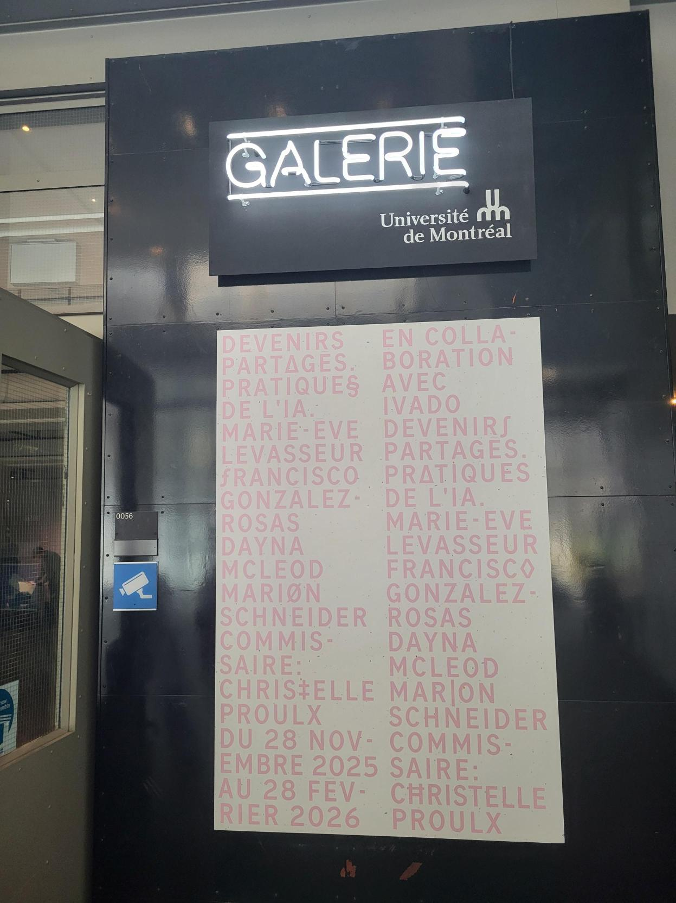

# Fiche d'exposition Galerie de l'Université de Montréal

## Nom de l’exposition ou de l’événement : 

Devenirs partagés. Pratiques de l’IA

## Lieu de mise en exposition : 

2940, ch. de la Côte-Sainte-Catherine, Montréal, QC, H3T 1B8

## Type d’exposition:  

Temporaire (prend fin le 28 février pour laisser place à une autre exposition)

## Date visite :

30 janvier 2026

## Titre de l’œuvre ou du dispositif :

TECHNO-COMPOST 01 (DECOMPOSITION) / TECHNO-COMPOST 02 (LE BRUIT RVB ET L'ESPACE LATENT EN TANT QUE JARDIN)

## Nom de l’artiste/firme : 

Marie-Ève Levasseur

## Année de réalisation : 

2025

## Description de l’œuvre :
 
  Techno-compost 01 : Cette réalisation combine plusieurs images générées par une intelligence artificielle. L’artiste a fait de multiples tentatives avant d’en arriver au résultat souhaité. Par la suite, elle a découvert, sur son ordinateur, un dossier avec des centaines d’images non-utilisées par le logiciel, appelées données d’entraînement. Les images projetées sont une collection de combinaisons de ces images.

Techno-compost 02 : Papier peint sur lequel on retrouve l’ensemble des images faisant partie du dossier retrouvé sur son ordinateur. On peut voir que le contenu des images se précise au fil des tentatives réalisées.

Chaises : Le visiteur est invité à s’asseoir sur une chaise en forme de scarabée avant de mettre un casque de réalité virtuelle. Celui-ci peut ressentir des vibrations dans son dos durant tout le long de l’expérience. Le casque, une fois mis, nous plonge dans un environnement qui peut nous faire penser à une hallucination. Des formes sont visibles sans que l’on puisse identifier réellement de quoi il s’agit, des images d’insectes ou de poissons, qui en contiennent soit une multitude ou un seul, tombent du plafond et peuvent être ramassées et tenues par le visiteur pendant quelques secondes, certaines remplies de bruit et d’autres dont le contenu est parfaitement identifiable. La chaise contient quelques-une des ces images, d'ailleurs.

## Type d’installation : 

Interactive

## Mise en espace :

Le visiteur entre dans la galerie et est directement introduit à l'exposition par une affiche située sur le mur à sa droite : L'oeuvre que j'ai choisi se trouve dans le coin de la pièce qui lui face. Techno-compost 01 est projeté sur le mur avant qui est adjacent à l'affiche, alors que Techno-compost 02 est présenté sur le même mur.

## Composantes et techniques

Haut-parleurs : Un son de basse fréquence est diffusé en dessous du dossier des deux chaises, donnant l'impression au spectateur que la chaise vibre. Ces derniers sont reliés à une prise de courant situé juste en dessous de Techno-compost 01.

Console audio Behringer : Permet de gérer le volume sonore sortant des haut-parleurs et plusieurs autres paramètres. 

Ordinateur Lenovo ThinkCentre : Héberge les fichiers audios diffusés par le haut-parleur.

Routeur D-Link : Garde l'ordinateur connecté à Internet.

## Éléments de mise en exposition

Projecteur : Permet la présentation des diapositives de Techno-compost 01.

Casques VR : Plongent le spectateur à l'intérieur d'une expérience virtuellement principalement basée sur Techno-compost 02.

Chaise : Permet de poser les casques et s'asseoir pour apprécier l'expérience virtuelle.

Papier peint : Permet la présentation des images de Techno-compost 02.

## Expérience vécue :

En arrivant dans la salle d'exposition, j'ai instantanément distingué cette oeuvre en raison d'une caractéristique bien évidente : Son côté expérimental. J'adore la question que s'est posée l'autrice : Quelles sont les procédures informatiques cachées derrière la génération d'images par intelligence artificielle ? Le fait que ces logiciels manipulent de multiples images simultanément pour uniquement présenter ce qu'il estime être le meilleur résultat n'est pas quelque chose que je m'attendais à apprendre. L'expérience virtuelle m'a fait penser au courant artistique psychédélique, de par ces motifs surréels, presque hallucinatoires, déformées ainsi que ses couleurs variées et vives. Elle m'a déstabilisée, surstimulée, à un tel point où j'avais du mal à expliquer ce que je voyais devant moi, comme le démontre cette vidéo. 

## Ce qui m'a plu :

- L'expérience en réalité virtuelle
- Le caractère expérimental de l'oeuvre
- Le fait qu'elle démontre les imperfections de l'intelligence artificielle

## Ce que vous feriez autrement :

- Organiser l'espace de sorte à ce que les fils électriques ne soient pas dans le chemin pour se déplacer d'une oeuvre à l'autre. Il s'agit d'une des premières choses que l'on voit en arrivant dans la zone d'exposition, ce qui lui donne une apparence bâclée.

## Références :

