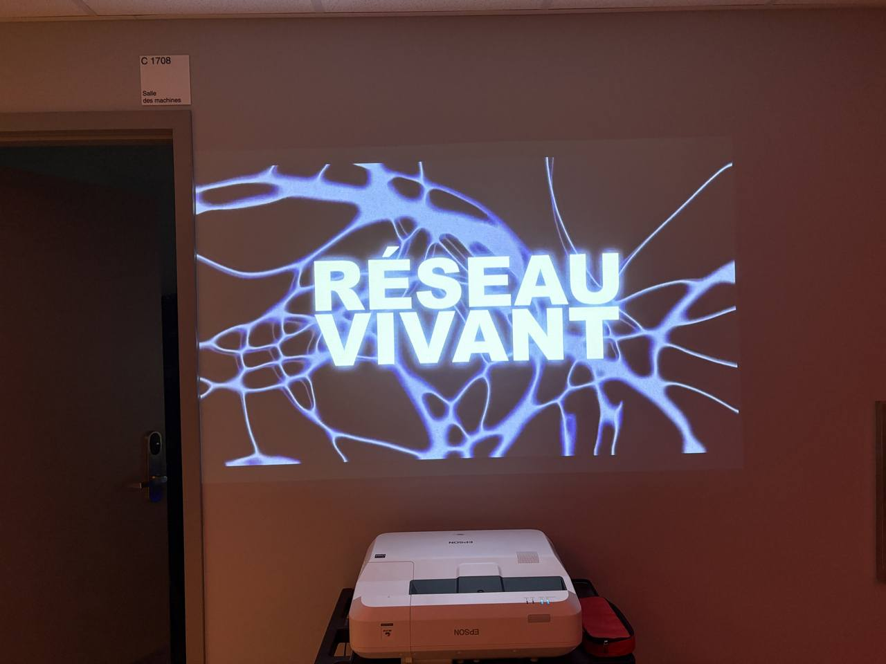
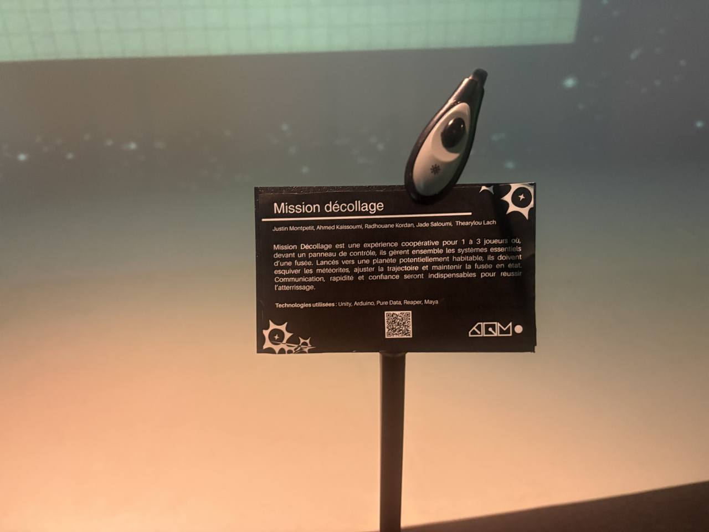
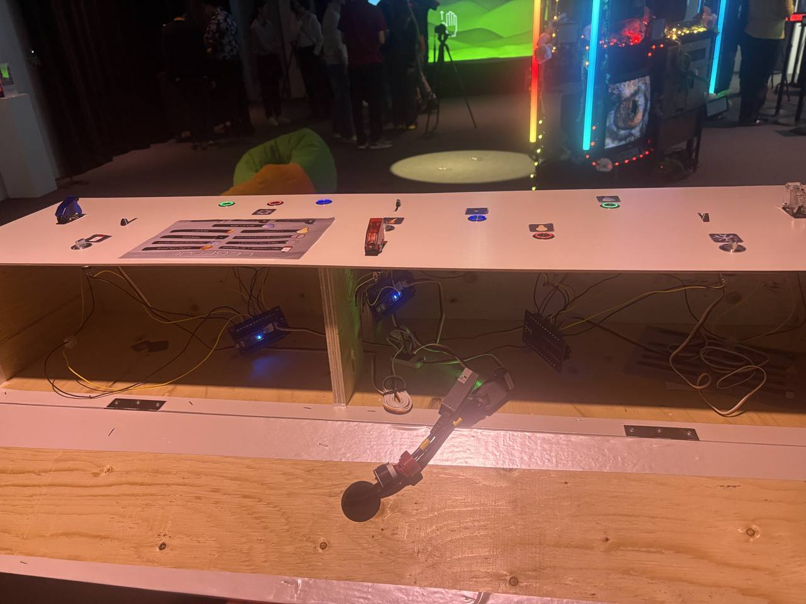
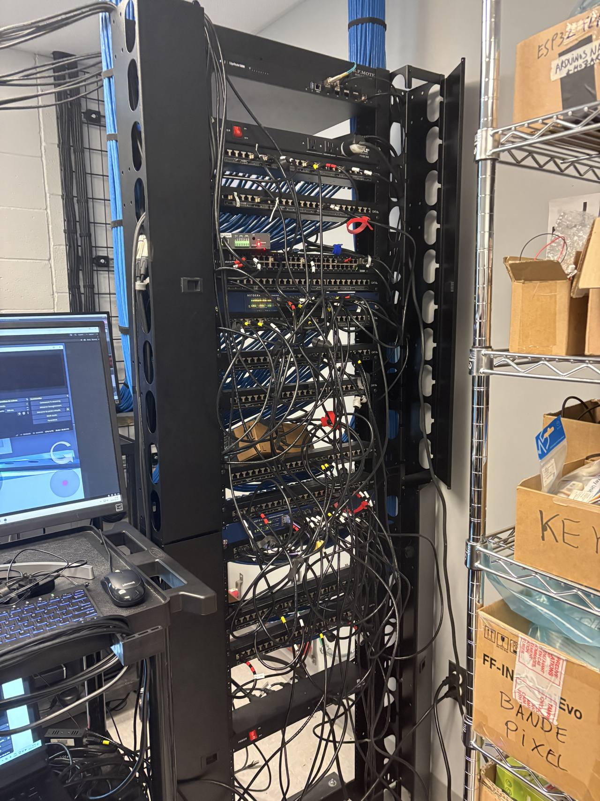
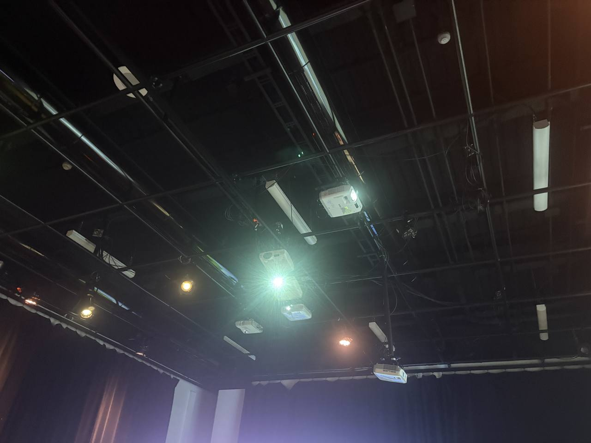
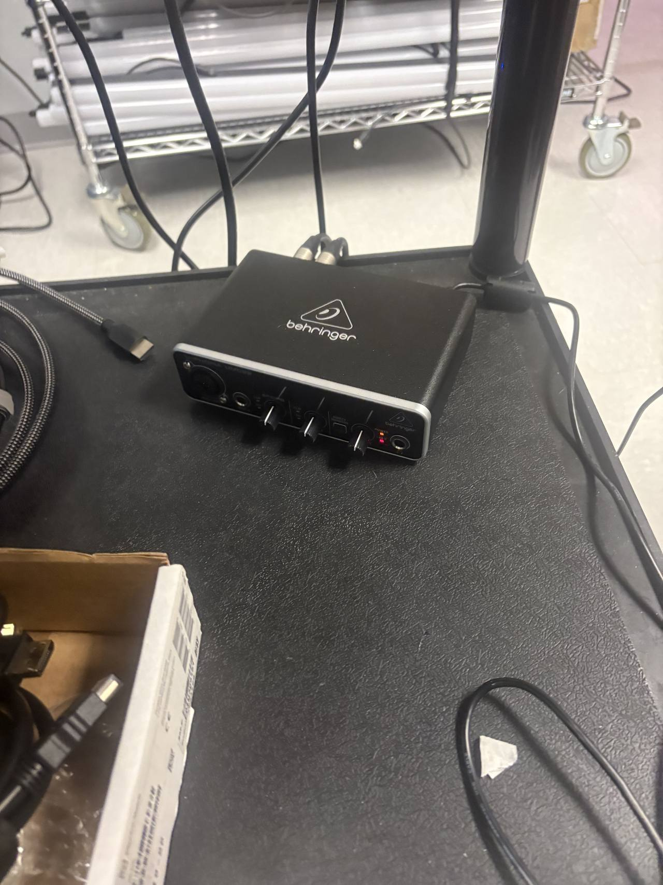
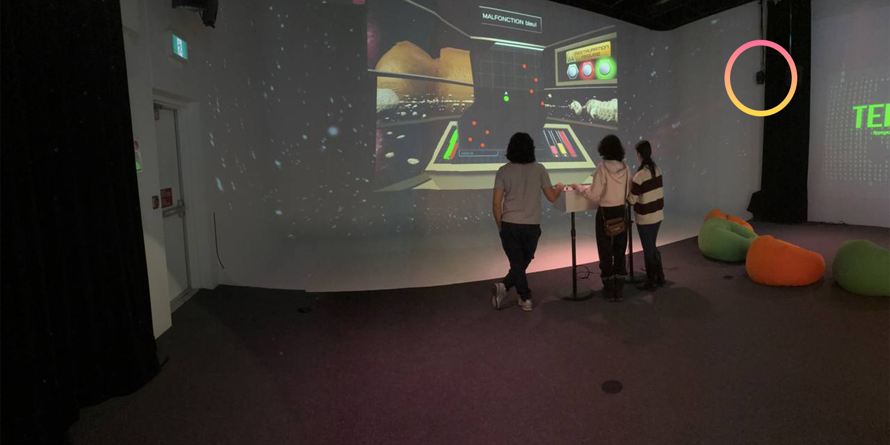
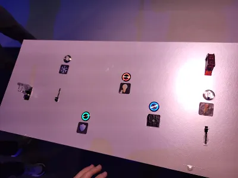
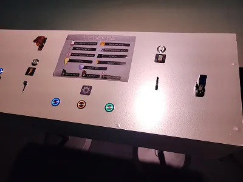

# Fiche d'exposition Réseau Vivant - Collège Montmorency

## Nom de l'exposition :

RÉSEAU VIVANT

## Lieu de mise en exposition :

475 Boulevard de l'avenir, Laval Quebec H7N 5H9 (Collège Montmorency, Grand studio, local C-1712)

## Type d'exposition :

Temporaire (Lundi 16 mars 2026 au 19 mars 2026)

## Date de ma visite :

Mardi 17 mars 2026

## Titre de l'oeuvre ou du dispositif :

Mission décollage

## Nom des artistes :

Justin Montpetit, Ahmed Kaissoumi, Radhouane Kordan, Jade Saloumi, Thearylou Lach

## Année de réalisation : 

2026

## Description de l'oeuvre ou du dispositif :

Le joueur arrive devant un panneau de contrôle comportant plus d'une dizaine de boutons. Ces derniers servent, après une courte cinématique, à contrôler un jeu vidéo dans lequel une fusée doit atteindre la planète Mars en évitant une pluie d'astéroïdes. Certains d'entre eux permettent aux joueurs de se protéger contre ces corps étrangers (L'électricité, pour pouvoir voir devant lui, le bouclier, lui permettant de perdre moins de vie après être rentr), servent à garder la fusée stable (température) alors que d'autres permettent simplement au joueur de contrôler la fusée (glisseurs pour réguler la vitesse et les réacteurs pour tourner à gauche ou à droite). Si le ou les joueurs atteignent une distance inférieure ou égale à 2000 km par rapport à leur destination d'arrivée, ils peuvent alors s'éjecter de la fusée et atteindre leur objectif final en actionnant un interrupteur situé au centre du panneau de contrôle (il s'agit de la petite structure avec un couvert vitré ou plastifié rouge translucide que l'on voit dans la photo visible dans la section composantes et techniques, juste en dessous de la description sur l'arduino). Un pointage, entre 0 et 100, est présenté selon le nombre d'erreurs réalisés durant le trajet.

## Type d'installation :

Interactive

## Fonction du dispositif multimédia :

Scénographie

## Mise en espace :

Le joueur entre dans le Collège Montmorency par l'une des entrées du bâtiment et se dirige vers le grand studio du programme de Techniques d'intégration multimédia, c'est-à-dire le local C-1712. Il passe à travers un about, une toute petite pièce servant d'intermédiaire entre le studio et l'extérieur. Il, elle ou iel arrive alors dans la pièce principale, se dirige complètement au fond de celle-ci et voit les images du jeu projetées sur un cyclorama blanc.

SCHÉMA À FAIRE.

## Composantes et techniques :

Arduino : Capte les interactions des joueurs avec le panneau de contrôle et les transmet à l'ordinateur (1)

Étagère d'équipement réseau : Garde l'ordinateur connecté à Internet

Projecteurs (il y en a deux, un pour le jeu et un autre pour l'arrière-plan thématique) : Transmettent les images du jeu provenant de l'ordinateur.

Console audio Behringer : Permettent de gérer les niveaux sonores des haut-parleurs.

Haut-parleurs : Transmettent le son du jeu. Il y en a deux, pour un son en stéréo.

## Éléments nécessaires à la mise en exposition :

Panneau de contrôle : Permet au joueur de contrôler la fusée dans laquelle il se trouve dans le jeu vidéo.

## Expérience vécue :

J'ai joué à ce jeu à deux reprises. La première fois, lorsque nous étions allé voir les projets des étudiants une semaine avant l'exposition. J'avais alors trouvé les mécaniques du jeu extrêmement complexes à maîtriser pour une simple raison : Sur le panneau de contrôle, rien ne nous indiquait visuellement ou appuyer pour contrôler les différentes fonctions du vaisseau. Il fallait avoir mémorisé les explications des créateurs du projet, ce qui n'était pas simple considérant que le panneau de contrôle comportait une quinzaine de boutons. À force, le jeu devenait laçant en raison de sa difficulté. Je trouvais néanmoins qu'il s'agissait d'un concept très intéressant, un jeu qui serait exceptionnel si ces quelques défauts étaient corrigés, ce que les créateurs du jeu ont fait. Sa difficulté a été diminuée et puisqu'il était alors possible de compléter le jeu et voir son résultat, cela m'incitait à rejouer encore et encore pour battre ma meilleure performance. La seconde fois, j'aurais joué potentiellement 2 heures si le temps me l'avait permis. L'équipe derrière la conception de ce projet a parfaitement compris la formule à suivre pour attirer l'attention d'un maximum de personnes lors de l'exposition : Créer un jeu vidéo avec des mécaniques et un visuel addictifs.

(Voir l'image de vue d'ensemble)

## Ce qui m'a plu :

- Présentation d'un pointage à la fin du jeu, nous incitant à rejouer encore et encore pour s'améliorer
- Logique entre la température et l'électricité (si nous voulions réalimenter le vaisseau en électricité, cela signifiait également que la température augmentait. Il fallait donc correctement doser la charge correctement afin d'éviter que le vaisseau surchauffe et explose.

## Ce que je ferais autrement :

- Forcer le joueur à se rendre beaucoup plus près de Mars avant de pouvoir s'éjecter du vaisseau (500, 1000 km au lieu de 2000 ?)
- Ajout de d'autres niveaux avec d'autres planètes et introduction progressive des mécaniques (le jeu est trop court)

## Références :

1 - Radhouane Kordan, 17 mars 2026

