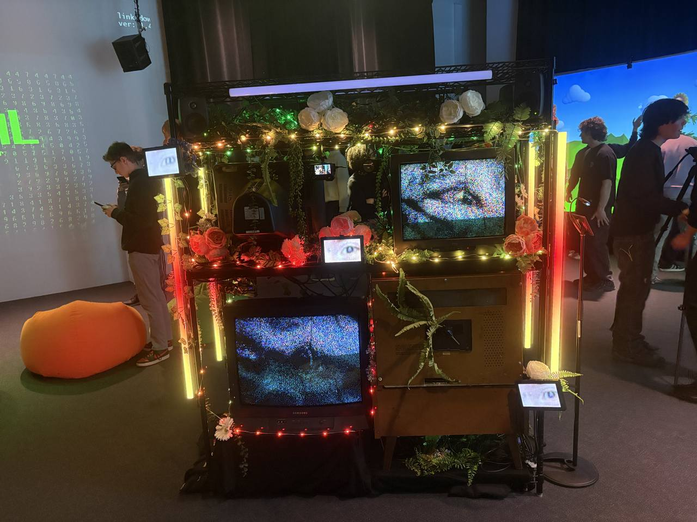
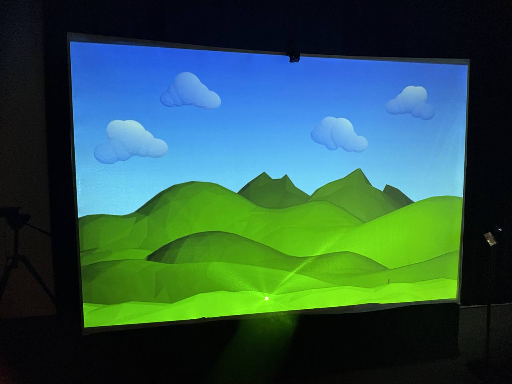
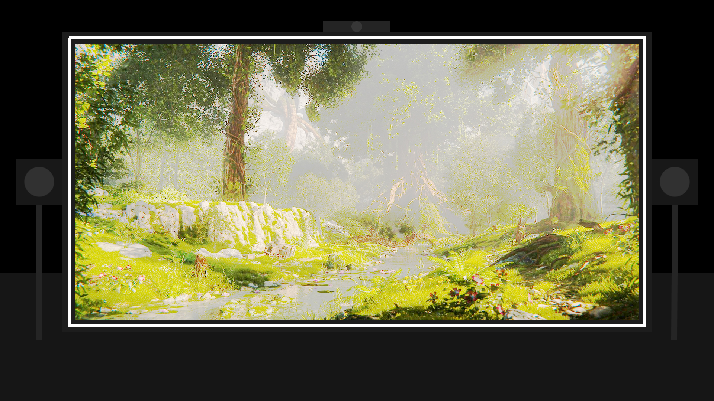
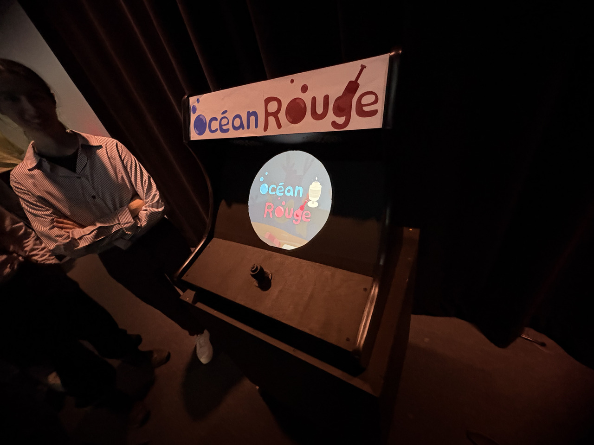
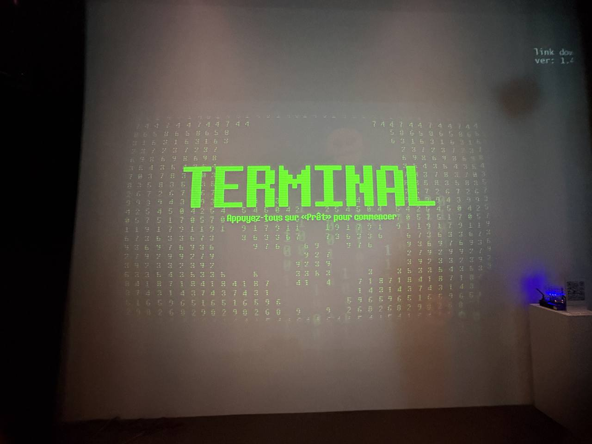
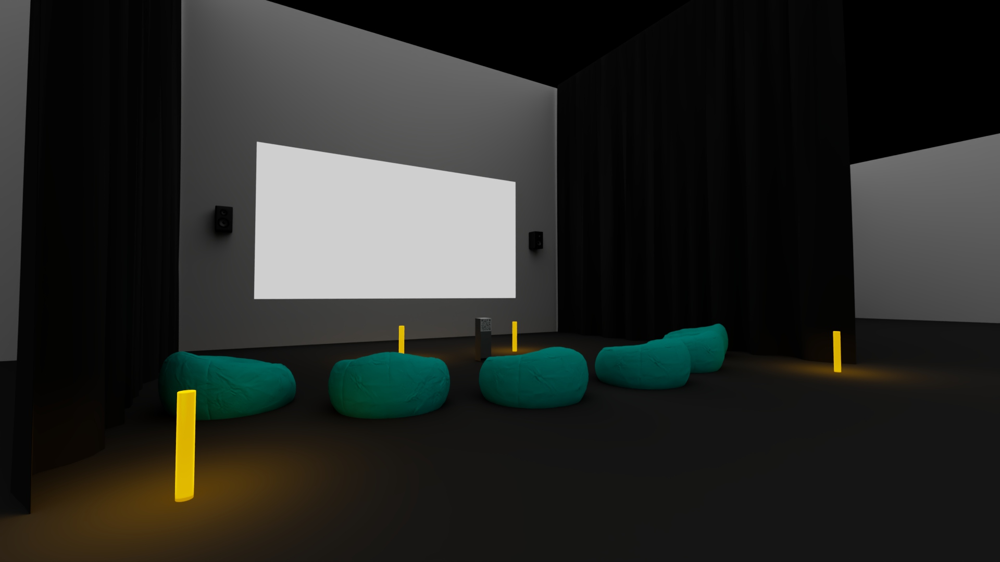
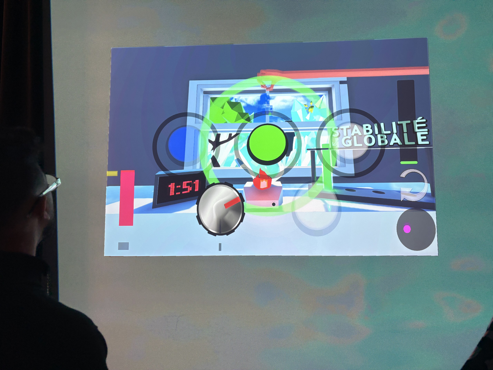
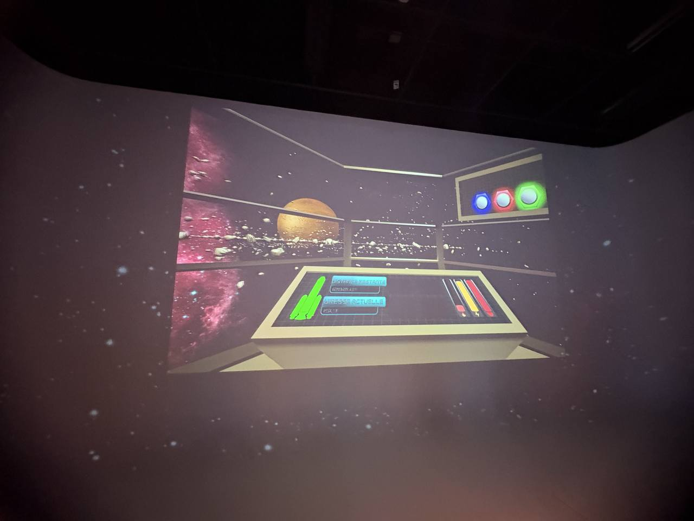
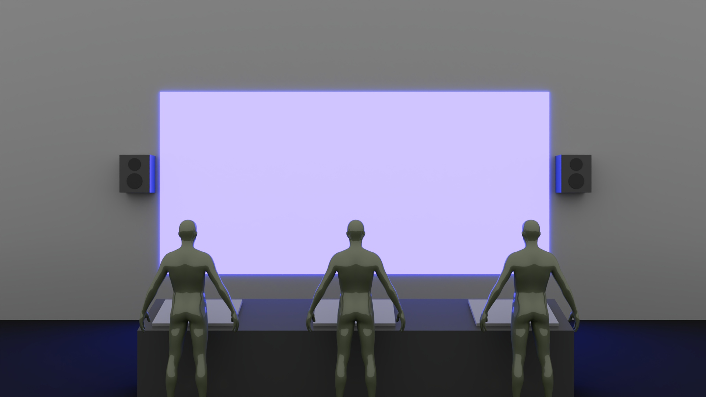

# Palmarès des dispositifs multimédias de l'exposition « Dispositifs multimédias »

## 6 - Quand les yeux se croisent (Edelwyn Ledru, Félix Lavoie, Jade Hébert, Manel Yaya, Patricia Nassif)

 (1)

La première question que je me suis posé par rapport à ce dispositif, avant d'en faire la découverte au grand studio, est la suivante : À quoi sert ce dispositif multimédia ? Comment l'équipe derrière le projet réussira-t-elle à me rendre intéressé par leur ouvrage ? Elle ne l'a pas fait. Si l'exécution technique derrière le projet est absolument irréprochable et certains détails du dispositif ont leur charme, en particulier, à mon avis, les télévisions rétros, le concept proposé semble avoir été peu réfléchi. On s'expose devant un projecteur, puis deux caméras captent notre regard pour ensuite les diffuser sur une télévision. J'ai eu l'impression qu'ils avaient visé comme but de rendre leur oeuvre interactive pour pouvoir dire qu'elle l'est, rien d'autre. De plus, j'ai l'impression que les cinq accolytes n'ont pas pris soin de trouver une manière d'assurer la compréhension de leur oeuvre par les visiteurs. J'ai demandé à Jade Hébert ce que l'oeuvre représentait pour son équipe, et son explication s'est limitée au fait qu'ils avaient cherché à créer un dialogue entre humains et animaux avec l'oeuvre (2). Cependant, à travers la faible qualité des images présentées (bourrées de bruit, très gros plan) il serait très difficile pour une personne qui n'a pas lu leur répertoire GitHub de comprendre qu'il s'agit d'images d'animaux. 

## 5 - Arbre en face (Alexandre Gendron, Mikael Arseneau, Mathieu Willett, Matis Ghariani, Rafael Angon Dube)

 (3)

Un point positif majeur que je peux citer par rapport à ce dispositif est les techniques qu'ils ont utilisé pour en faire la promotion. Ils ont repris certains codes des vidéos des créateurs de contenu de l'ère courante de YouTube (ex : Transition où une personne se téléporte instantanément d'un lieu à un autre) lui donnant une ambiance dynamique et légère, en harmonie avec l'oeuvre présentée : En effet, lorsque j'ai appuyé sur l'écran pour faire pousser un arbre et ai vu que les créateurs du dispositif avaient insérés les visages des personnes qui avaient testé le dispositif "Quand les yeux se croisent" je me suis mis à rigoler. Cependant, une fois cette particularité découverte, on se lasse très rapidement du dispositif multimédia. Il y a quelques secrets cachés sur la toile, mais à des endroits qui ne sont presque pas accessibles en raison de leur hauteur.

## 4 - Océan Rouge (Amira Tounekti, Kristy Moussally) 

 (4)

Pour un projet réalisé par uniquement deux personnes, le résultat n'est vraiment pas si mauvais. J'ai eu énormément de mal à manier les contrôles du jeu pendant mon expérience avec le dispositif, mais je suis généralement très mauvais aux jeux vidéos et plusieurs autres personnes ont réussi à maitrîser ses mécaniques plus rapidement, voire même le compléter, donc, je suppose, dans l'ensemble, que sa difficulté est suffisamment équilibrée. Je souhaite également féliciter la directrice artistique de l'équipe, Kristy Moussally, qui a eu l'idée de mélanger les époques de l'histoire du jeu vidéo au sein d'une même oeuvre. En effet, par ses graphismes semblant être inspirés du courant flat design, on l'associe à l'ère courante. Cependant, le dispositif à travers duquel on peut y jouer ressemble à une vieille arcade. Cela n'empêche pas le fait que l'oeuvre aurait pu être bien meilleure qu'elle ne l'était : Je comprends que l'intention était de le faire ressembler à un oeil, mais le fait que l'écran soit rond m'empêchait de voir les déchets qui tombaient dans les coins inférieurs, diminuant ainsi mon efficacité pour les ramasser. De plus, il est bien d'avoir fait une banque de son, mais à quoi sert-elle si le son du jeu est à peine audible. L'équipe n'a en effet pas du tout pris en compte un détail technique très important : Le niveau de bruit dans la pièce. Pour contourner cette contrainte, Amira et Kristy auraient pu faire mettre un casque aux personnes avant qu'ils puissent jouer pour ainsi les immerser d'avantage dans l'univers du jeu.

## 3 - Terminal (Émeryk Belisle, Elie Daher, Ting Yung Lu Terry, Dana Saavedra-Torrano, Mégane Ranger)

 (5)

Le concept du jeu m'a vendu ce dispositif multimédia. J'ai énormément apprécié son aspect coopératif. Le fait que les actions d'une seule personne pouvaient ruiner la partie des autres ajoutait une dynamique très intéressante à notre expérience de jeu : Une frustration envers l'incompétent de notre partie qui mourrait deux fois plus que les autres joueurs, notamment. Les contrôles du jeu sont simples et relativement rapides, à maîtriser. En somme, l'équipe d'Émeryk Belisle a suivi à la lettre la recette pour produire un jeu vidéo addictif. Cependant, l'oeuvre perd ÉNORMÉMENT d'un point de vue technique : Après avoir complété un certain nombre de niveaux (je ne me rappelle plus exactement combien, mais celui-ci variait en fonction du nombre de joueurs), nous tombions systématiquement sur un niveau où les contrôles du jeu ne fonctionnaient pas, une erreur s'expliquant fort probablement par le fait que le code n'était simplement pas terminé pour certains niveaux. 

## 2 - Symbiose (Yannick Chamberland, Benjamin Ferland, Ryan Dufault, Walid Cheour)

 (6)

J’ai aimé ce dispositif pour essentiellement les mêmes raisons que celui classé en troisième position. Or, contrairement à Terminal, Symbiose est un jeu parfaitement fonctionnel qui, en plus, n’a aucune fin définie. La difficulté du jeu augmente progressivement et seules les actions de l’équipe déterminent combien de temps leur partie durera. Le processus de démarrage d’une partie est beaucoup plus rapide, là où pour jouer à Terminal, il fallait scanner un code QR pour se connecter à la partie, puis attendre que tous les autres rejoignent la partie et se déclarent prêts à jouer. Dans le cas de ce jeu, appuyer un bouton suffit. J’adore aussi l’esthétique du jeu, l’apparence « cartoonesque » des objets mais aussi l’écran de télévision faisant office de chronomètre.

## 1 - Mission Décollage (Ahmed Kaissoumi, Radhouane Kordan, Justin Montpetit, Thearylou Lach, Jad Saloumi)

 (7)

Avec Mission Décollage, Ahmed Kaissoumi, Radhouane Kordan, Justin Montpetit, Thearylou Lach et Jad Saloumi ont réussi, à mes yeux, à se distinguer de toutes les autres oeuvres présentées durant l'exposition Réseau vivant. La thématique de l'espace donne un charme incroyable à l'oeuvre présentée. L'ambiance sonore contribuait également à m'immerger dans l'univers du jeu. Mais ce qui fait vraiment la force de Mission décollage par rapport aux autres projets est sans doute la réceptivité des membres de l'équipe aux critiques reçues dans le formulaire d'évaluation rempli par les visiteurs. En effet, lorsque nous avions visité le grand studio une première fois pour tester Misssion Décollage, alors encore en phase de développement, deux reproches principales avaient été adressées aux créateurs du jeu. La première : Le jeu était BEAUCOUP trop dûr à compléter. La seconde : On devait mémoriser ce que chacune des touches du panneau de contrôle faisait puisqu'on nous expliquait ses fonctionnalités uniquement au début de notre session de jeu et il en y avait des dizaines. Dans la semaine qui s'est écoulée entre notre visite et l'exposition, l'équipe de Mission Décollage a collé des étiquettes près des boutons pour rendre la maîtrise des contrôles du jeu plus facile et a diminué le nombre d'événements qui se produisaient. De plus, ils ont refait une bonne partie de l'interface, laquelle était, initialement, plutôt médiocre.

Pour plus d'informations sur cette oeuvre, voir fiche_EXPO_oeuvre_choisie.md où je la documente en détail.

## Références

1 - 
 
2 -
 
3 -
 
4 -
 
5 -
 
6 -
 
7 -

